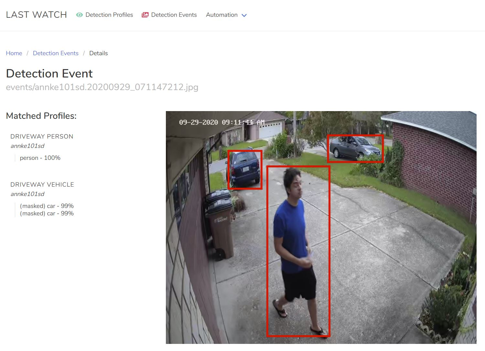
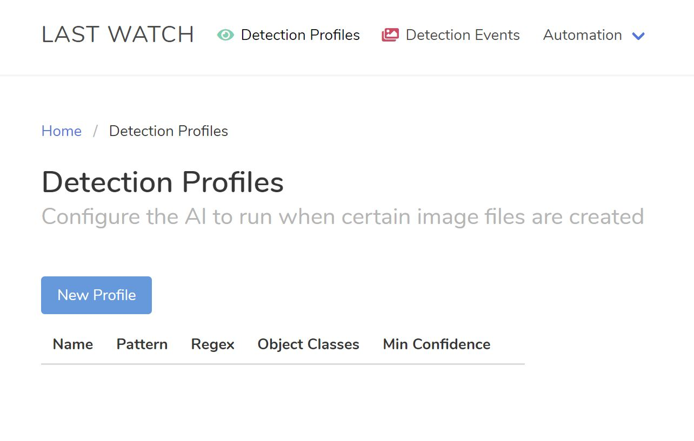
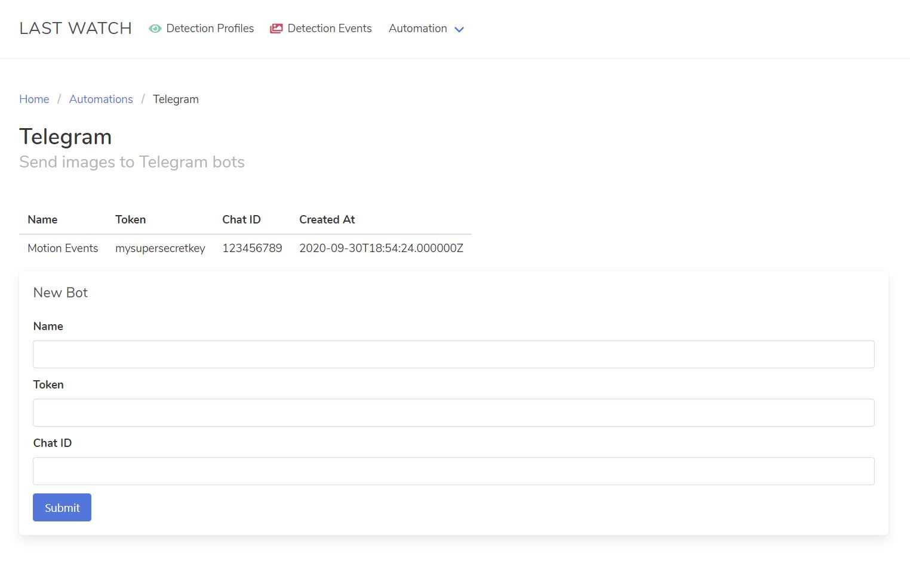
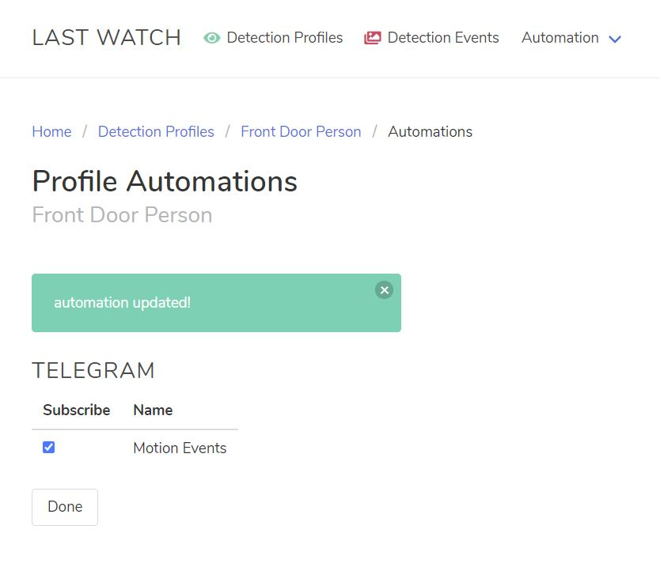

# Last Watch AI

Last Watch AI is a standalone tool for creating if-then automations based on computer vision events. A primary use for this tool is the automation of motion events from NVR software such as Blue Iris. This project was heavily inspired by [gentlepumpkin/bi-aidetection](https://github.com/gentlepumpkin/bi-aidetection).

## How it works

Last Watch watches for new image files and uses AI to check each image for a range of objects such as cars or people. If a relevant object is detected, automations are triggered.

The most common use case is for NVR home security systems. For example, Last Watch can be set up to send Telegram messages when a person is detected on a camera.

Last Watch runs completely "offline". All processing is handled localling using [DeepStack AI Server](https://deepstack.cc/). Last Watch is also platform independent thanks to containerization using Docker.

## Features

Goals of this project:

* Platform Independence - everything runs in Docker containers
* Extensibility - designed to be forked and added to
* Web-based Interface - desktop and mobile friendly
* Web API - everything can be managed with http requests
* 100% locally hosted

Supported Automations:

* Telegram - send images to bot
* Folder Copy - copy images to a local folder
* Smb/Cifs - upload images to a Samba share (Home Assistant, Synology)
* Web Request - make http requests

## Installation

** install the latest stable version of Docker first **

1. Download the latest release zip and extract the files

2. Edit .env file at the root level and set the watch folder location as desired

3. Run docker-compose command to start the containers: `docker-compose up -d --build site`

## Upgrading

1. Download the latest release zip and extract the files

2. Stop all existing containers: `docker-compose down`

3. Copy mysql folder from previous install into the new install folder

4. Run migrations: `docker-compose run --rm artisan migrate`

5. Start the containers: `docker-compose up -d --build site`

## Usage

Follow the instructions above to start the containers. Once running, visit http://localhost:8080/ and you should be greeted with this page:

The first step is to create a Detection Profile. A Detection Profile is how you will define triggers for your automations. Once you have created a profile, Last Watch will look for files in the watch folder which match the File Pattern you specified. If the AI finds relevant objects in the matched files, then the automations will be triggered.

Once you save your first profile, you will be redirected to the next step to link the profile to your automations. This page will be empty at first, because you have no automations defined! 

Naturally, the next step is to define some automations. Navigate to one of the Automation pages in the header, for example Telegram:

Give the automation a unique name and fill out the configuration details, and Submit it. Now, you can navigate back to the Detection Profiles page and click the link to manage the Automations for your profile.

Now your automation will show up and you can link it to your profile.

At this point, Last Watch will be looking for files in the watch folder that match the file pattern you specified. If a match is found, a detection event will be generated in the Detection Events page. If a relevant object is detected by the AI, the event will be marked as Relevant and the automations will be triggered.

## Building from source

1. git clone https://github.com/akmolina28/last-watch-ai.git

2. cd last-watch-ai

3. cp src/.env.example src/.env

4. docker-compose run --rm composer install

5. docker-compose run --rm artisan key:generate

7. docker-compose run --rm artisan storage:link

8. docker-compose run --rm artisan migrate

9. docker-compose run --rm npm install

11. docker-compose run --rm npm run watch-poll
