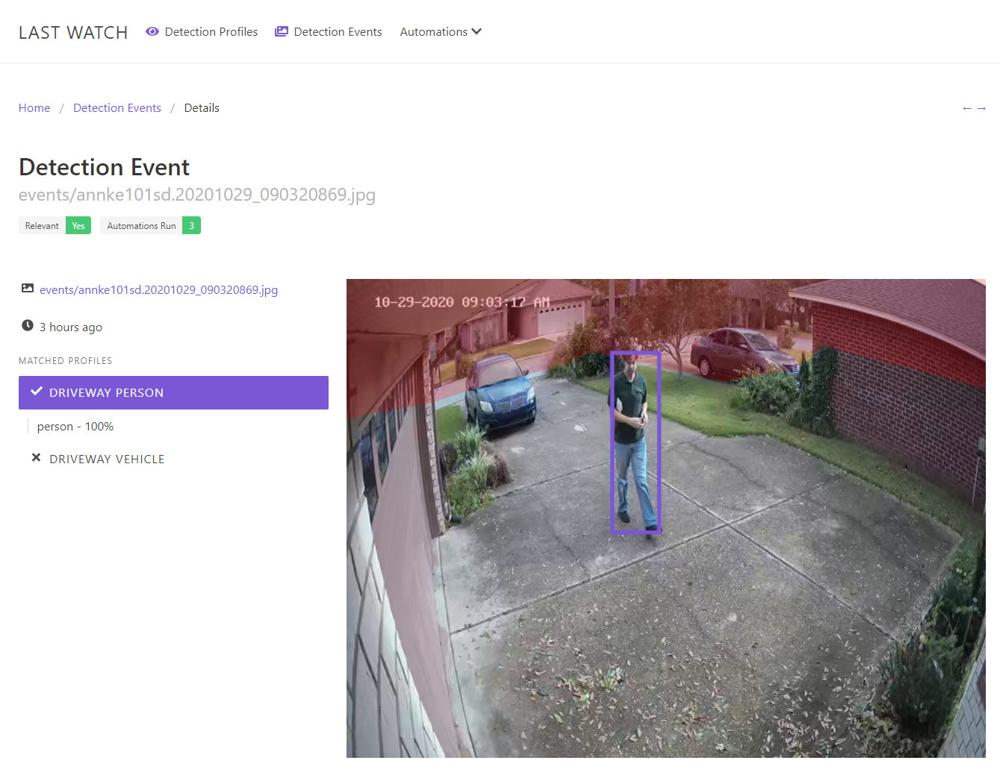

# Last Watch AI [](https://travis-ci.com/akmolina28/last-watch-ai) [](https://github.styleci.io/repos/296938596)

Last Watch AI is a locally hosted application for creating if-then automations based on computer vision events. Last Watch can be used in tandem with IP camera software to trigger actions if the AI detects certain objects, like cars, people, or animals.

This project was heavily inspired by [gentlepumpkin/bi-aidetection](https://github.com/gentlepumpkin/bi-aidetection).



## How it works

Last Watch watches for new image files in a configurable directory, then checks each image for a range of objects such as cars or people. Different automations can be set up to trigger if the AI detects relevant objects in the images.

A primary use case for Last Watch is to enhance Video Management Systems such as Blue Iris. For example, Last Watch can be set up to send messages and trigger video recording when a person is detected on security camera.

## Features

* Platform Independence - everything runs in Docker containers
* Web Interface - desktop and mobile friendly
* [Web API](https://github.com/akmolina28/last-watch-ai/blob/dev/docs/API.md) - everything can be managed with REST
* Offline and locally hosted


Supported Automations:

* Telegram - send images to bot
* Folder Copy - copy images to a local folder
* Smb/Cifs - upload images to a Samba share (Home Assistant, Synology)
* Web Request - make http GET and POST requests
* MQTT - publish out MQTT messages

## Installation

Last Watch has been tested on Windows, Debian, and Arch Linux. Dual-core CPU and 2GB of memory are recommended.

[Detailed Windows Setup Guide](https://kleypot.com/last-watch-ai-windows-setup/)

[Detailed Ubuntu Setup Guide](https://kleypot.com/last-watch-ai-ubuntu-installation-and-upgrading/)


### Install From Source (recommended)

1. Clone the repo

```
git clone https://github.com/akmolina28/last-watch-ai.git

cd last-watch-ai
```

2. Create the .env file and set your config variables as desired

```
cp .env.example .env
nano .env
```

3. Build the application

```
sudo cp src/.env.example src/.env &&
sudo docker-compose up -d mysql &&
sudo docker-compose run --rm composer install --optimize-autoloader --no-dev &&
sudo docker-compose run --rm artisan route:cache &&
sudo docker-compose run --rm artisan key:generate --force &&
sudo docker-compose run --rm artisan storage:link &&
sudo docker-compose run --rm artisan migrate --force &&
sudo docker-compose run --rm npm install --verbose &&
sudo docker-compose run --rm npm run prod --verbose
```

4. Start the containers

```
sudo docker-compose up -d --build site
```

### Upgrading

1. Stop the containers during the upgrade

```
cd /path/to/last-watch-ai

sudo docker-compose down
```

2. Pull latest source code

```
git pull
```

3. Re-build application

```
sudo docker-compose run --rm composer install --optimize-autoloader --no-dev &&
sudo docker-compose run --rm artisan route:cache &&
sudo docker-compose run --rm artisan migrate --force &&
sudo docker-compose run --rm npm install --verbose &&
sudo docker-compose run --rm npm rebuild &&
sudo docker-compose run --rm npm run prod --verbose
```

4. Restart the containers

```
sudo docker-compose up -d --build site
```

### Install From Release Build

1. Install [Docker](https://docs.docker.com/docker-for-windows/install/) and [Docker Compose](https://docs.docker.com/compose/install/)

2. Download the [latest release](https://github.com/akmolina28/last-watch-ai/releases/) un-zip and extract the files

3. Set the watch folder and web port by editing the .env file

4. Start the containers with Docker Compose

```
docker-compose up -d --build site
```

## User Guide and Documentation

[User Guide](https://kleypot.com/last-watch-ai-user-guide/)

[Full Walkthrough with Blue Iris](https://kleypot.com/last-watch-ai-blue-iris-integration/)

[API Reference](https://github.com/akmolina28/last-watch-ai/blob/dev/docs/API.md)

Automation Examples:

* [Car Presence Sensor with Home Assistant and Last Watch AI](https://kleypot.com/vehicle-presence-sensor-with-home-assistant-and-last-watch-ai/)

## Contributing

Contributions are welcome and will be credited.

## Development and Testing

Last Watch is written in PHP on the [Laravel framework](https://laravel.com/) and the interface is written in [Vue.js](https://vuejs.org/). The Laravel application also functions as a headless API such that the interface can be completely bypassed if needed.

The application is made up of several Docker containers. Each container serves a different purpose:

* The Nginx, MySQL, and PHP containers make up the LEMP stack to host the Laravel app
* The Watcher is a node.js app that scans for image files and sends Webhook messages to the Laravel app
* The Deepstack container hosts the object detection API
* The Queue container handles [queued jobs](https://laravel.com/docs/8.x/queues) from the Laravel app using Supervisor
* The Scheduler is a cron-like container that handles [scheduled tasks](https://laravel.com/docs/8.x/scheduling) from the Laravel app
* NPM, artisan, composer, and testing containers are also defined to help with development and building

To get started with development, follow the steps to install the project from source. Use your favorite IDE to edit the source files and recompile the front-end using Webpack. You can run `docker-compose run --rm npm run watch` to automatically recompile when files are changed.

To execute tests, use the built in phpunit container by running `docker-compose run --rm phpunit`. This container will also stand up separate testing containers for mysql and deepstack to run the feature tests.

<a href="https://www.buymeacoffee.com/akmolina28" target="_blank"></a>
