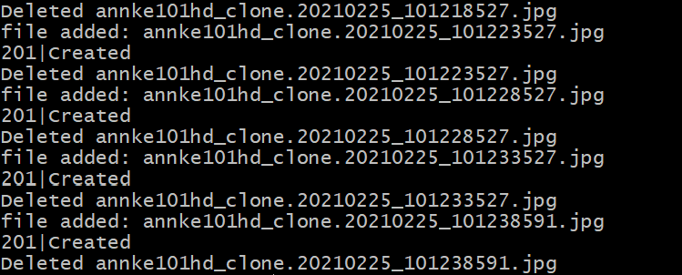

# Last Watch AI - File Watcher

Last Watch AI includes a container, the File Watcher, which automatically creates Detection Events when a new image is created in a configurable directory on your file system. This way, you can set your IP Camera to save jpegs somewhere and Last Watch will automatically pick them up.

This document will explain how the File Watcher works, and how it can be configured or disabled completely.

### How it works

The File Watcher is a [very simple node.js app](https://github.com/akmolina28/webhook-folder-watcher) which is configured to watch a directory on your file system. Here is a step-by-step breakdown of what the watcher does:

1. The container starts watching a directory on your file system (set with `WATCH_FOLDER`).

2. The watcher waits until a jpeg file is created in the watch folder by your IP camera or any other source.

3. The watcher reads the jpeg file and posts the image data to the webhook in Last Watch. Last Watch creates a new event, runs the AI and automations, saves the image on the webserver, and compresses it to save space (configurable with `COMPRESS_IMAGES`).

4. After sending the image, the watcher deletes the image file (configurable with `WATCH_FOLDER_AUTO_DELETE`).

### Configuration

There are a few .env variables you can use to configure the watcher.

* `WATCH_FOLDER` - The absolute path on the file system to watch for jpeg files (includes sub-directories). Example: /home/myuser/aiinput

* `WATCH_USE_POLLING` - Instead of watching for file system events, set the watcher to poll for new files every 100ms. Only necessary if the file system events are not triggering, which can happen on some Windows systems, or if the watch folder is a network share.

* `WATCH_FOLDER_AUTO_DELETE` - Automatically delete images from the watch folder after they are sent to Last Watch. This is enabled by default to keep the watch folder small. There are [known issues](https://github.com/paulmillr/chokidar/issues/1057) in Docker which can cause high CPU usage when watching directories containing a large number of files.

### Disabling the watcher

The watch folder is included as a convenience to make it easy to integrate Last Watch with programs like Blue Iris. It is not required to use Last Watch. You have the option to call the webhook and pass in the image data yourself.

If you decide to bypass the watcher, you can disable it completely by adding this line to your .env file:

`COMPOSE_FILE=docker-compose.yml:./overrides/docker-compose.disable-watcher.yml`

### Troubleshooting

If images are not being auto-deleted, or detection events are not generated in Last Watch, you may have an issue with the file watcher. You can check the output of the watcher by running:

`sudo docker logs lw_watcher`

The output should look something like this:



Files are picked up, sent to the webhook (which responds with a 201), then deleted.

#### If files are not picked up...

Make sure the `WATCH_FOLDER` path in your .env file is correct. You can run `sudo docker exec -it lw_watcher ls /watch` to check if the watcher actually sees the image files.

After confirming that the path is correct and the watcher can see the files, if the files are still not picked up by the process, try enabling polling. Set `WATCH_USE_POLLING=true`.

#### If the webhook responds with 500 errors...

The watcher is sending the images to the webhook, but Last Watch is failing to process the images into detection events. Check the application logs:

```
cd /path/to/last-watch-ai
cat src/storage/logs/laravel.log
```

If you cannot resolve the error, create a new issue on Github.
